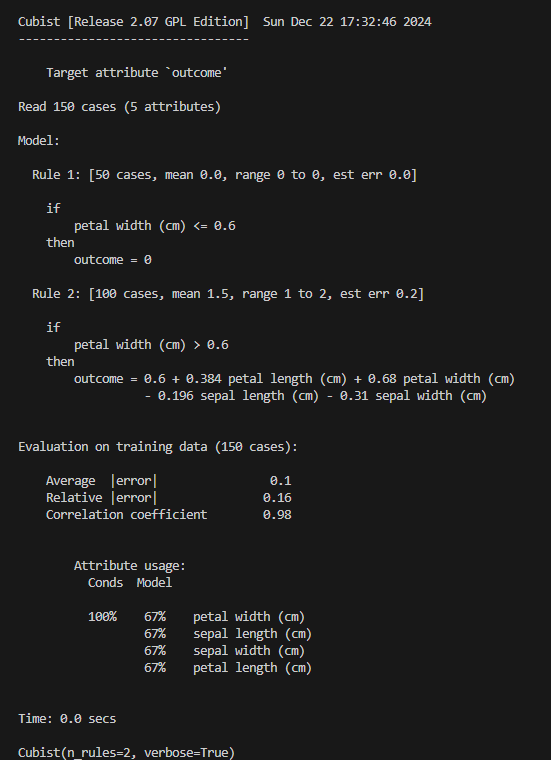

# Cubist

A Python package for fitting Quinlan's [Cubist](https://www.rulequest.com/cubist-unix.html) v2.07 regression model. Inspired by and based on the [R wrapper](https://github.com/topepo/Cubist) for Cubist. Designed after and inherits from the [scikit-learn](https://scikit-learn.org/stable/) framework.

## Installation 
```bash
pip install cubist
```
or
```bash
pip install --upgrade cubist
```

## Background
Cubist is a regression algorithm develped by John Ross Quinlan for generating rule-based predictive models. This has been available in the R world thanks to the work of Max Kuhn and his colleagues. With this package it is introduced to Python and made scikit-learn compatible for easy use with existing data and model pipelines. Additionally, cross-validation and control over whether Cubist creates a composite model is added here.

## Advantages
Unlike other ensemble models such as RandomForest and XGBoost, Cubist generates a set of rules, making it easy to understand precisely how the model makes it's predictive decisions. Thus tools such as SHAP and LIME are unnecessary as Cubist doesn't exhibit black box behavior. 

Like XGBoost, Cubist can perform boosting by the addition of more models (here called committees) that correct for the error of prior models (i.e. the second model created corrects for the prediction error of the first, the third for the error of the second, etc.). 

In addition to boosting, the model can perform instance-based (nearest-neighbor) corrections to create composite models, thus combining the advantages of these two methods. Note that with instance-based correction, model accuracy may be improved at the expense of computing time (this extra step takes longer) and some interpretability as the linear regression rules are no longer completely followed. It should also be noted that a composite model might be quite large as the full training dataset must be stored in order to perform instance-based corrections for inferencing. A composite model will be used when `composite=True` or Cubist can be allowed to decide whether to take advantage of this feature with `composite='auto'`.

## Use
```python
from sklearn.datasets import fetch_california_housing
from cubist import Cubist
X, y = fetch_california_housing(return_X_y=True, as_frame=True)
model = Cubist() # <- model parameters here
model.fit(X, y)
model.predict(X)
model.score(X, y)
```

## Sample Output
<p align="center">
    
</p>

The above image is a sample of the verbose output produced by Cubist. It first reports the total number of cases (rows) and attributes (columns) in the training dataset. Below that it summarizes the model by committee (if used but not in this sample) and rule where each rule is definined by an if..then statement along with metrics for this rule in the training data and the linear regression equation used for each rule. The 'if' section of each rule identifies the training input columns and feature value ranges for which this rule holds true. The 'then' statement shows the linear regressor for this rule. The model performance is then summarized by the average and relative absolute errors as well as with the Pearson correlation coefficient r. Finally, the output reports the usage of training features in the model and rules as well as the time taken to complete training.

## Model Parameters
The following parameters can be passed as arguments to the ```Cubist()``` class instantiation:
- n_rules (int, default=500): Limit of the number of rules Cubist will build. Recommended value is 500.
- n_committees (int, default=0): Number of committees to construct. Each committee is a rule based model and beyond the first tries to correct the prediction errors of the prior constructed model. Recommended value is 5.
- neighbors (int, default=None): Number between 1 and 9 for how many instances should be used to correct the rule-based prediction. If no value is given, Cubist will build a rule-based model only. If this value is set, Cubist will create a composite model with the given number of neighbors. Regardless of the value set, if auto=True, Cubist may override this input and choose a different number of neighbors. Please assess the model for the selected value for the number of neighbors used.
- unbiased (bool, default=False): Should unbiased rules be used? Since Cubist minimizes the MAE of the predicted values, the rules may be biased and the mean predicted value may differ from the actual mean. This is recommended when there are frequent occurrences of the same value in a training dataset. Note that MAE may be slightly higher.
- auto (bool, default=False): A value of True allows the algorithm to choose whether to use nearest-neighbor corrections and how many neighbors to use. False will leave the choice of whether to use a composite model to value passed to the `neighbors` parameter.
- extrapolation (float, default=0.05): Adjusts how much rule predictions are adjusted to be consistent with the training dataset. Recommended value is 5% as a decimal (0.05)
- sample (float, default=None): Percentage of the data set to be randomly selected for model building (0.0 or greater but less than 1.0).
- cv (int, default=None): Whether to carry out cross-validation (recommended value is 10)
- random_state (int, default=randint(0, 4095)): An integer to set the random seed for the C Cubist code.
- target_label (str, default="outcome"): A label for the outcome variable. This is only used for printing rules.
- verbose (int, default=0) Should the Cubist output be printed? 1 if yes, 0 if no.

## Considerations
- For small datasets, using the `sample` parameter is probably inadvisable because Cubist won't have enough samples to produce a representative model.
- If you are looking for fast inferencing and can spare accuracy, skip using a composite model by not setting a value for `neighbors`.

## Model Attributes
The following attributes are exposed to understand the Cubist model results:
- feature_importances_ (pd.DataFrame): Table of how training data variables are used in the Cubist model.
- rules_ (pd.DataFrame): Table of the rules built by the Cubist model and the percentage of data for which each rule condition applies.
- coeff_ (pd.DataFrame): Table of the regression coefficients found by the Cubist model.
- variables_ (dict): Information about all the variables passed to the model and those that were actually used.

## Benchmarks
There are many literature examples demonstrating the power of Cubist and comparing it to Random Forest as well as other bootstrapped/boosted models. Some of these are compiled here: https://www.rulequest.com/cubist-pubs.html. To demonstrate this, some benchmark scripts are provided in the respectively named folder.

## Literature for Cubist
- https://sci2s.ugr.es/keel/pdf/algorithm/congreso/1992-Quinlan-AI.pdf
- http://citeseerx.ist.psu.edu/viewdoc/download?doi=10.1.1.34.6358&rep=rep1&type=pdf

## Publications Using Cubist
- https://www.rulequest.com/cubist-pubs.html
- https://www.linkedin.com/pulse/machine-learning-example-r-using-cubist-kirk-mettler

## To Do
- Add visualization utilities
- Add benchmark scripts
