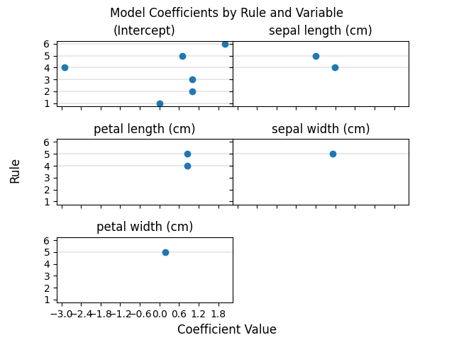
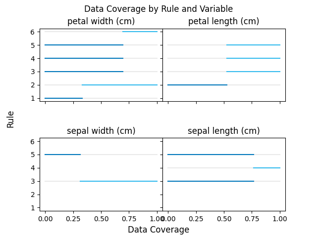

# Cubist

[](https://badge.fury.io/py/cubist)
[](https://github.com/pjaselin/Cubist/actions)
[](https://codecov.io/gh/pjaselin/Cubist)
[](https://pypi.python.org/pypi/cubist)
[](https://pypi.org/project/cubist)
[](https://pypi.org/project/cubist)
[](https://github.com/pre-commit/pre-commit)

A Python package for fitting Quinlan's [Cubist](https://www.rulequest.com/cubist-unix.html) v2.07 regression model. Inspired by and based on the [R wrapper](https://github.com/topepo/Cubist) for Cubist. Developed as a [scikit-learn](https://scikit-learn.org/stable/) compatible estimator.

<!-- START doctoc generated TOC please keep comment here to allow auto update -->
<!-- DON'T EDIT THIS SECTION, INSTEAD RE-RUN doctoc TO UPDATE -->
**Table of Contents**  *generated with [DocToc](https://github.com/thlorenz/doctoc)*

- [Installation](#installation)
  - [Model-Only](#model-only)
  - [Optional Dependencies](#optional-dependencies)
- [Background](#background)
- [Advantages](#advantages)
- [Sample Usage](#sample-usage)
- [Cubist Model Class](#cubist-model-class)
  - [Model Parameters](#model-parameters)
  - [Model Attributes](#model-attributes)
- [Visualization Utilities](#visualization-utilities)
  - [Coefficient Display](#coefficient-display)
    - [CubistCoefficientDisplay.from_estimator Parameters](#cubistcoefficientdisplayfrom_estimator-parameters)
    - [CubistCoefficientDisplay Sample Usage](#cubistcoefficientdisplay-sample-usage)
  - [Coverage Display](#coverage-display)
    - [CubistCoverageDisplay.from_estimator Parameters](#cubistcoveragedisplayfrom_estimator-parameters)
    - [CubistCoverageDisplay Sample Usage](#cubistcoveragedisplay-sample-usage)
- [Considerations](#considerations)
- [Benchmarks](#benchmarks)
- [Literature for Cubist](#literature-for-cubist)
  - [Original Paper](#original-paper)
  - [Publications Using Cubist](#publications-using-cubist)

<!-- END doctoc generated TOC please keep comment here to allow auto update -->

## Installation

### Model-Only

```bash
pip install --upgrade cubist
```

### Optional Dependencies

To enable visualization utilities:

```bash
pip install cubist[viz]
```

For development:

```bash
pip install cubist[dev]
```

## Background

Cubist is a regression algorithm developed by John Ross Quinlan for generating rule-based predictive models. This has been available in the R world thanks to the work of Max Kuhn and his colleagues. It is introduced to Python with this package and made scikit-learn compatible for use with at ecosystem. Cross-validation and control over whether Cubist creates a composite model is also enabled here.

## Advantages

Unlike other ensemble models such as RandomForest and XGBoost, Cubist generates a set of rules, making it easy to understand precisely how the model makes it's predictive decisions. Tools such as SHAP and LIME are therefore unnecessary as Cubist doesn't exhibit black box behavior.

Like XGBoost, Cubist can perform boosting by the addition of more models (called committees) that correct for the error of prior models (i.e. the second model created corrects for the prediction error of the first, the third for the error of the second, etc.).

In addition to boosting, the model can perform instance-based (nearest-neighbor) corrections to create composite models, combining the advantages of these two methods. Note that with instance-based correction, model accuracy may be improved at the expense of compute time (this extra step takes longer) and some interpretability as the linear regression rules are no longer completely followed. It should also be noted that a composite model might be quite large as the full training dataset must be stored in order to perform instance-based corrections for inferencing. A composite model will be used when `auto=False` with `neighbors` set to an integer between 1 and 9. Cubist can be allowed to decide whether to take advantage of composite models with `auto=True` and `neighbors` left unset.

## Sample Usage

```python
>>> from sklearn.datasets import load_iris
>>> from sklearn.model_selection import train_test_split
>>> from cubist import Cubist
>>> X, y = load_iris(return_X_y=True, as_frame=True)
>>> X_train, X_test, y_train, y_test = train_test_split(
...     X, y, test_size=0.05, random_state=42
... )
>>> model = Cubist(n_rules=2, verbose=True)
>>> model.fit(X_train, y_train)

Cubist [Release 2.07 GPL Edition]  Sat Dec 28 19:52:49 2024
---------------------------------

    Target attribute `outcome'

Read 142 cases (5 attributes)

Model:

  Rule 1: [48 cases, mean 0.0, range 0 to 0, est err 0.0]

    if
        petal width (cm) <= 0.6
    then
        outcome = 0

  Rule 2: [94 cases, mean 1.5, range 1 to 2, est err 0.2]

    if
        petal width (cm) > 0.6
    then
        outcome = 0.2 + 0.76 petal width (cm) + 0.271 petal length (cm)
                  - 0.45 sepal width (cm)


Evaluation on training data (142 cases):

    Average  |error|                0.1
    Relative |error|               0.16
    Correlation coefficient        0.98


        Attribute usage:
          Conds  Model

          100%    66%    petal width (cm)
                  66%    sepal width (cm)
                  66%    petal length (cm)


Time: 0.0 secs

Cubist(n_rules=2, verbose=True)
>>> model.predict(X_test)
array([1.1257    , 0.        , 2.04999995, 1.25449991, 1.30480003,
       0.        , 0.94999999, 1.93509996])
>>> model.score(X_test, y_test)
0.9543285583162371
```

## Cubist Model Class

### Model Parameters

The following parameters can be passed as arguments to the ```Cubist()``` class instantiation:

- n_rules: Limit of the number of rules Cubist will build. Recommended value is 500.
- n_committees: Number of committees to construct. Each committee is a rule based model and beyond the first tries to correct the prediction errors of the prior constructed model. Recommended value is 5.
- neighbors: Integer between 1 and 9 for how many instances should be used to correct the rule-based prediction. If no value is given, Cubist will build a rule-based model only. If this value is set, Cubist will create a composite model with the given number of neighbors. Regardless of the value set, if auto=True, Cubist may override this input and choose a different number of neighbors. Please assess the model for the selected value for the number of neighbors used.
- unbiased: Should unbiased rules be used? Since Cubist minimizes the MAE of the predicted values, the rules may be biased and the mean predicted value may differ from the actual mean. This is recommended when there are frequent occurrences of the same value in a training dataset. Note that MAE may be slightly higher.
- auto: A value of True allows the algorithm to choose whether to use nearest-neighbor corrections and how many neighbors to use. False will leave the choice of whether to use a composite model to the value passed `neighbors`.
- extrapolation: Adjusts how much rule predictions are adjusted to be consistent with the training dataset. Recommended value is 5% as a decimal (0.05)
- sample: Percentage of the data set to be randomly selected for model building (0.0 or greater but less than 1.0) and held out for model testing. When using this parameter, Cubist will report evaluation results on the testing set in addition to the training set results.
- cv: Whether to carry out cross-validation (recommended value is 10)
- random_state: An integer to set the random seed for the C Cubist code.
- target_label: A label for the outcome variable. This is only used for printing rules.
- verbose: Should the Cubist output be printed? 1 if yes, 0 if no.

### Model Attributes

The following attributes are exposed to understand the Cubist model results:

- model_: The trained Cubist model.
- output_: The pretty print summary of the Cubist model.
- feature_importances_: DataFrame of how input variables are used in model conditions and regression equations.
- n_features_in_: The number of features seen during model fitting.
- feature_names_in_: List of features used to train Cubist.
- splits_: Table of the splits created by the Cubist model.
- coeffs_: Table of the regression coefficients found by the Cubist model.
- version_: The Cubist model version.
- feature_statistics_: Model statistics (e.g. global mean, extrapolation %, ceiling value, floor value)
- committee_error_reduction_: Error reduction by using committees.
- n_committees_used_: Number of committees used by Cubist.

## Visualization Utilities

Based on the R Cubist package, a few visualization utilities are provided to allow some exploration of trained Cubist models. Differing from the original package, these are extended somewhat to allow configuration of the subplots as well as for selecting a subset of variables/attributes to plot.

### Coefficient Display

The `CubistCoefficientDisplay` plots the linear regression coefficients and intercepts selected by the Cubist model. One subplot is created for each variable/attribute with the rule number or committee/rule pair on the y-axis and the coefficient value plotted along the x-axis.

#### CubistCoefficientDisplay.from_estimator Parameters

- estimator: The trained Cubist model.
- committee: Optional parameter to filter to only committees at or below this committee number.
- rule: Optional parameter to filter to only rules at or below this rule number.
- feature_names: List of feature names to filter to in the plot. Leaving unselected plots all features.
- ax: An optional Matplotlib axes object.
- scatter_kwargs: Optional keywords to pass to `matplotlib.pyplot.scatter`.
- gridspec_kwargs: Optional keywords to pass to `matplotlib.pyplot.subplots`.

#### CubistCoefficientDisplay Sample Usage

```python
>>> import matplotlib.pyplot as plt
>>> from sklearn.datasets import load_iris
>>> from cubist import Cubist, CubistCoverageDisplay
>>> X, y = load_iris(return_X_y=True, as_frame=True)
>>> model = Cubist().fit(X, y)
>>> display = CubistCoverageDisplay.from_estimator(estimator=model)
>>> plt.show()
```



### Coverage Display

The `CubistCoverageDisplay` is used to visualize the coverage of rule splits for a given dataset. One subplot is created per input variable/attribute/column with the rule number or comittee/rule pair plotted on the y-axis and the coverage ranges plotted along the x-axis, scaled to the percentage of the variable values.

#### CubistCoverageDisplay.from_estimator Parameters

- estimator: The trained Cubist model.
- X: An input dataset comparable to the dataset used to train the Cubist model.
- committee: Optional parameter to filter to only committees at or below this committee number.
- rule: Optional parameter to filter to only rules at or below this rule number.
- feature_names: List of feature names to filter to in the plot. Leaving unselected plots all features.
- ax: An optional Matplotlib axes object.
- line_kwargs: Optional keywords to pass to `matplotlib.pyplot.plot`.
- gridspec_kwargs: Optional keywords to pass to `matplotlib.pyplot.subplots`.

#### CubistCoverageDisplay Sample Usage

```python
>>> import matplotlib.pyplot as plt
>>> from sklearn.datasets import load_iris
>>> from cubist import Cubist, CubistCoverageDisplay
>>> X, y = load_iris(return_X_y=True, as_frame=True)
>>> model = Cubist().fit(X, y)
>>> display = CubistCoverageDisplay.from_estimator(estimator=model, X=X)
>>> plt.show()
```



## Considerations

- For small datasets, using the `sample` parameter is probably inadvisable as Cubist won't have enough samples to produce a representative model.
- If you are looking for fast inferencing and can spare accuracy, consider skipping using a composite model by leaving `neighbors` unset.
- Models that produce one or more rules without splits (i.e. a single linear model which holds true for the entire dataset), will return an empty `splits_`attribute while the coefficients will be available in the `coeffs_` attribute.

## Benchmarks

There are many literature examples demonstrating the power of Cubist and comparing it to Random Forest as well as other bootstrapped/boosted models. Some of these are compiled here: [Cubist in Use](https://www.rulequest.com/cubist-pubs.html). To demonstrate this, some benchmark scripts are provided in the respectively named folder.

## Literature for Cubist

### Original Paper

- [Learning with Continuous Classes](https://sci2s.ugr.es/keel/pdf/algorithm/congreso/1992-Quinlan-AI.pdf)

### Publications Using Cubist

- [Cubist in Use](https://www.rulequest.com/cubist-pubs.html)
- [A Machine Learning Example in R using Cubist](https://www.linkedin.com/pulse/machine-learning-example-r-using-cubist-kirk-mettler)
